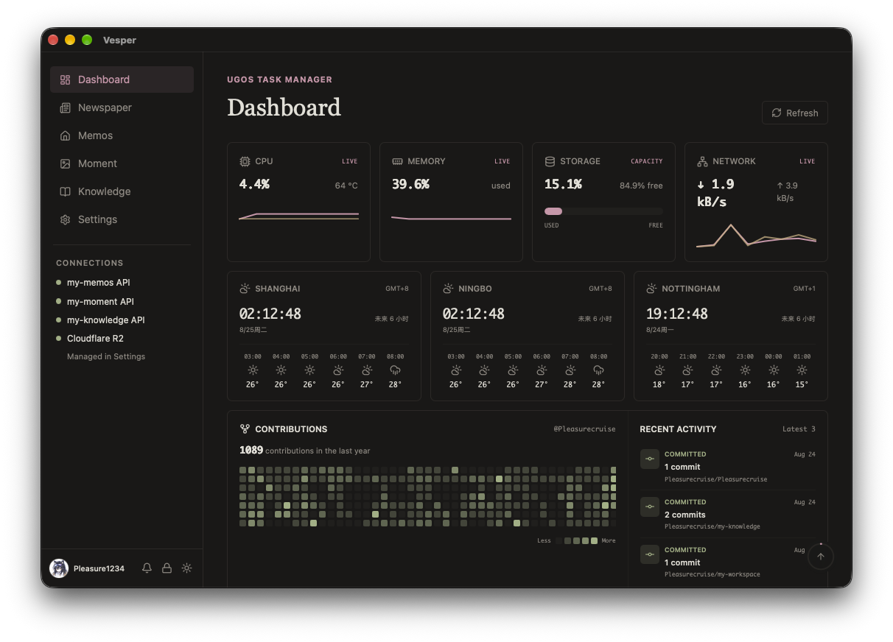
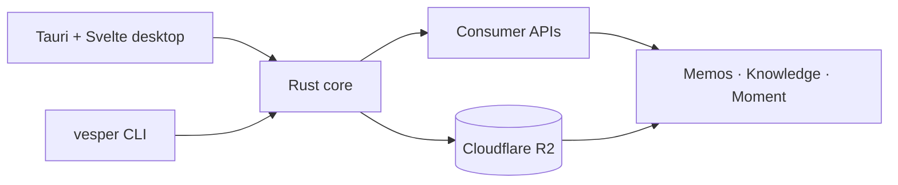

<div align="center">
  
  <h1>Vesper</h1>
  <p><strong>A personal operating console for the things that matter.</strong></p>
  <p>Content, infrastructure, daily tasks, and AI usage — brought together in one local-first desktop app.</p>
</div>

<p align="center">
  
</p>

Vesper is a focused desktop workspace backed by a Rust core. It combines a live personal dashboard
with Memos, Moment, Knowledge, Todo, and publishing workflows, while keeping credentials in the
operating-system credential store.

It is designed to stay open throughout the day: glance at system health, capture an idea, review a
photo stream, continue a longer draft, or publish content without switching between unrelated tools.

## Everything in one place

- **Dashboard** — UGOS telemetry, weather, GitHub activity, Todo, and AI usage or balances
- **Memos** — write, search, pin, favorite, archive, and restore short-form notes
- **Moment** — browse and manage a personal photo stream with progressive R2-backed images
- **Knowledge** — create and read long-form Markdown with a focused article experience
- **Newspaper** — a calm daily view projected from Knowledge
- **CLI** — reuse the same Rust capability crates for Todo, content builds, publication, and
  consumer workflows

## Built around clear boundaries

- **Local first** — the desktop experience starts immediately and keeps credentials in the
  operating-system store
- **One trusted core** — Rust owns commands, network access, content compilation, publication, and
  runtime behavior
- **Focused interfaces** — Svelte provides a calm, responsive view layer while the CLI exposes the
  same underlying workflows for automation



The workspace is built with Tauri v2, Svelte 5, Rust, and a small shared UI package. Companion APIs
remain responsible for their own durable records, while Cloudflare R2 stores images and published
artifacts.

> [!IMPORTANT]
> Vesper is a highly customized personal workspace built around one person's infrastructure,
> accounts, content conventions, and daily workflow. It is not an out-of-the-box general-purpose
> application. A fork needs compatible companion services such as `my-memos`, `my-knowledge`, and
> `my-moment`, plus its own APIs, Cloudflare R2 storage, credentials, and optional dashboard
> integrations.

## Build from source

```sh
pnpm install
pnpm dev
pnpm check
pnpm test
```

Create a desktop installer with `pnpm build:desktop`, or build the CLI with `pnpm build:cli`.
Install the CLI locally with `pnpm cli:install`, then run `vesper`.

## Documentation

- [Documentation index](docs/README.md)
- [Architecture](docs/ARCHITECTURE.md)
- [Dashboard integrations](docs/DASHBOARD.md)
- [Development and releases](docs/DEVELOPMENT.md)
- [Local-to-consumer workflow](docs/WORKFLOW.md)
- [Design system](docs/DESIGN.md)
- [Code style](docs/STYLEGUIDE.md)
