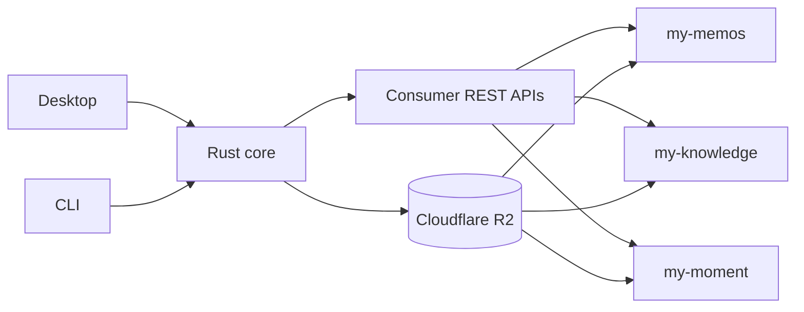

# Vesper

A local-first desktop and CLI workspace for authoring content, previewing consumer data,
publishing static artifacts, monitoring a UGOS Pro NAS, and reading AI subscription balances.

- **Desktop** — Tauri v2 with a Svelte 5 view layer and Rust application commands
- **CLI** — `vesper` commands for Todo, builds, publication, Memos, Knowledge, and Moment
- **Content** — consumer APIs for metadata and direct R2 reads for Markdown and image bodies
- **Dashboard** — Todo, GitHub activity, UGOS telemetry, weather, and AI usage or balances
- **Credentials** — operating-system credential store or existing pi credential records



## Quick start

```sh
pnpm install
pnpm dev
pnpm check
pnpm test
```

Use `pnpm build:desktop` or `pnpm build:cli` for deliverable builds. Install the CLI with
`pnpm cli:install`, then run `vesper`.

## Documentation

- [Documentation index](docs/README.md)
- [Architecture](docs/ARCHITECTURE.md)
- [Dashboard integrations](docs/DASHBOARD.md)
- [Development and operations](docs/DEVELOPMENT.md)
- [Local-to-consumer workflow](docs/WORKFLOW.md)
- [Markdown pipeline](docs/MARKDOWN.md)
- [Design system](docs/DESIGN.md)
- [Code style](docs/STYLEGUIDE.md)

## Current scope

Memos and Moment read metadata through their deployed REST APIs and bodies from R2. Knowledge reads
its Worker API. Publication uploads new artifacts and does not delete destination-only objects.
