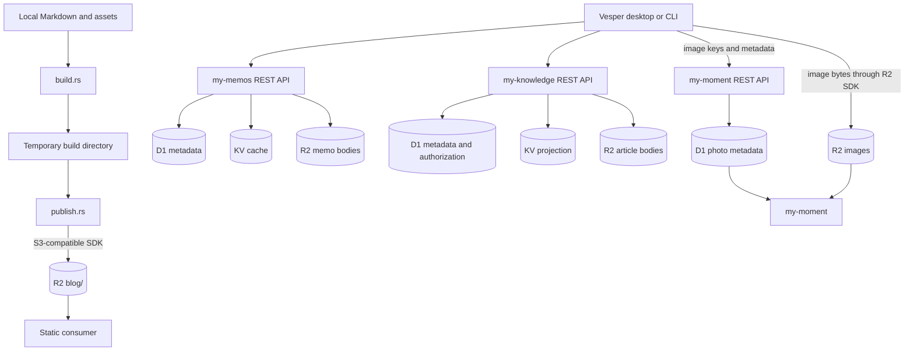

# Local-to-Consumer Workflow

Vesper has two delivery paths. Static publication uploads a complete local build to R2. Consumer
operations update one deployed application through its authenticated API, with direct R2 access only
where binary transfer is intentionally owned by the local client.

## Infrastructure map



## Static publication

`vesper build` delegates to `build.rs`. The builder walks `content/`, renders Markdown through
`md-dialect`, highlights fenced code with Syntect, renders `mermaid` fences to SVG, compiles content
embeds, copies regular assets, rejects symbolic links and output collisions, and writes
`content.json` into an operating-system temporary directory. Generated styles are embedded in the
HTML artifact. Invalid Markdown dialect input fails before an upload plan exists.

Namespaced GitHub and stock fences resolve their data locally through `quotes`. Architecture and
storyboard fences accept accessible authored SVG and sanitize it with `svg-hush`. The complete
syntax, alignment options, and authoring examples live in `.agents/skills/vesper-cli/SKILL.md`.

`vesper publish` builds the same directory and reports the planned object count. It does not mutate
remote state. `vesper publish --live` passes the staged files to `publish.rs`, which uploads them
through `r2.rs` below the `blog/` prefix. The temporary directory is removed when its Rust guard is
dropped. Publication is additive and does not delete destination-only objects.

## CLI input

Content commands accept inline Markdown or JSON, `--file <path>`, or `--stdin` in the payload's
position. File and standard-input reads preserve newlines and require UTF-8; read and parse errors
stop before consumer requests. This applies to Memo create/update/page/patch, Knowledge
page/create/update-draft/update-documents/visibility, and Moment query/create/update/upload-photo.

```sh
vesper memo create --file note.md
vesper knowledge update-documents <id> --file article.json
cat filters.json | vesper moment query --stdin
vesper moment upload-photo --file metadata.json photo.heic
```

## Memos

Memo metadata operations use the my-memos REST API. Create, update, and delete requests must pass
through the Worker so R2 bodies, D1 metadata, and KV invalidation remain one server-coordinated
transaction. List and search return the D1 body mirror with each `r2Key`; Vesper renders that body
locally without a second R2 read.

CLI surface:

```text
vesper memo get <id>
vesper memo tags
vesper memo list [limit]
vesper memo page <json>
vesper memo search <query>
vesper memo create <markdown>
vesper memo import-x <url> [public|private]
vesper memo update <id> <markdown>
vesper memo patch <id> <json>
vesper memo visibility <id> <public|private>
vesper memo pin <id>
vesper memo unpin <id>
vesper memo favorite <id>
vesper memo unfavorite <id>
vesper memo archive <id>
vesper memo restore <id>
vesper memo delete <id>
```

`memo page` accepts `cursor`, `limit`, `search`, `tags`, `sortByUpdated`, `archivedOnly`, and
`favoritesOnly`, matching desktop feed reads. The two final filters are mutually exclusive. `memo
patch` accepts the same optional `content`, `visibility`, `tags`, `pinned`, `favorite`, and
`archived` fields as the desktop command contract and rejects an empty object.
`memo import-x` uses the same Rust FxTwitter import and favorite-creation flow as the desktop. It
creates a private favorite by default; pass `public` explicitly to publish it.

## Knowledge

Knowledge always enters through the authenticated my-knowledge REST API. The Worker performs D1
authorization before resolving KV or R2 data. Updates and deletion include the current
`expectedHash`; a stale local copy fails instead of overwriting a newer article.
The desktop Knowledge editor creates drafts and sends edits through the same API, preserving the
loaded content hash for conflict detection.

Complex create and update payloads are passed as one quoted JSON argument. This keeps multilingual
documents and optional fields aligned with the API contract rather than inventing a second CLI
schema.

```text
vesper knowledge list [cursor]
vesper knowledge page <json>
vesper knowledge get <id>
vesper knowledge create <json>
vesper knowledge update-draft <id> <json>
vesper knowledge update-documents <id> <json>
vesper knowledge visibility <id> <json>
vesper knowledge delete <id> <expected-hash>
```

`knowledge page` exposes the compact listing capability used by the consumer's `listArticles` MCP
tool through the same REST service. It accepts `cursor`, `limit` (1–100), `tags` (up to five), and
`visibility` (`public` or `private`), returning `{ articles, cursor }` without fetching or rendering
article bodies. `knowledge list` retains its existing rendered-document projection; use `get` when
an edit needs the complete source and current content hash.

## Moment

Moment separates local image preparation, binary transfer, and metadata coordination. The shared
Rust path prepares one source image, uploads its normalized original and thumbnail to R2, then
registers their exact object keys with the REST API. The consumer resolves metadata from D1 and reads
the image objects from R2.

```text
vesper moment upload-photo <json> <source-image>
vesper moment upload <r2-key> <local-path>
vesper moment create '<json-with-r2Key-and-thumbnailR2Key>'
```

`moment upload-photo` is the coordinated path shared with the desktop. Its JSON uses the `Upload`
contract and the source may be PNG, JPEG, WebP, AVIF, or HEIC up to 20 MB. Rust applies camera
orientation, uses available EXIF time and coordinates when the JSON omits them, derives the normalized
PNG, JPEG thumbnail, and ThumbHash, then uploads both objects and registers metadata. Objects written
by the operation are removed if a later step fails. The lower-level `upload` and `create` commands
remain available for explicit recovery workflows.

If metadata registration fails, the uploaded objects are orphans. Inspect the error, retry the same
metadata request, or explicitly remove the orphan with `vesper moment remove-object <r2-key>`. Do not
remove an object referenced by an existing photo record. `moment delete <id>` is the normal metadata
deletion path; raw object removal is an explicit maintenance operation.

The remaining Moment commands cover tags, listing, search, metadata updates, downloads, and deletion:

```text
vesper moment get <id>
vesper moment query <json>
vesper moment tags
vesper moment list [cursor]
vesper moment search <query>
vesper moment update <id> <json>
vesper moment download <r2-key> <local-path>
vesper moment delete <id>
```

`moment query` exposes MCP-style metadata browsing through REST: `fromDate` and `toDate` use
`YYYY-MM-DD`, `tags` filters the photo list, and `limit` is 1–100 (the service defaults to 20).
Alternatively, `search` queries titles, descriptions and tags. Search cannot be combined with dates
or tags because the service does not apply those filters in search mode. The result is `{ photos }`
with no invented pagination cursor. `moment get` reads one photo directly by ID.

The desktop sends the original image and user-entered metadata into the same Rust workflow. Its
viewer sends title, description, and tag edits to the authenticated Moment update endpoint and sends
confirmed deletion through the Moment delete endpoint, which remains responsible for coordinating
metadata and stored-image removal.

## Todo

Todo is a local, credential-free workflow shared by desktop and CLI. Both operate on the date-keyed
`todos.json` file and serialize mutations with its sidecar lock; the obsolete `today-todos.json`
format is never read or migrated. Commands default to the current local date, while
`todo --date YYYY-MM-DD` targets the same historical or future date available in the desktop
calendar. At midnight, only a desktop view still showing today advances to the next date.

```text
vesper todo list
vesper todo get <id>
vesper todo create <text>
vesper todo update <id> <text>
vesper todo complete <id>
vesper todo reopen <id>
vesper todo delete <id>
vesper todo schedule-path
vesper todo import-ics <path>...
vesper todo sync-ics
```

`schedule-path` prints the managed sibling `ics` directory. `import-ics` validates every supplied
source before installing any of them under their original file names, then syncs the selected date;
files placed in that directory directly are validated on the next read. The parser accepts the
documented recurrence subset, floating local values, UTC values, and IANA TZID-qualified times;
zoned times are projected into the device time zone before date selection. Malformed structure,
unknown zones, duplicate or unsupported RRULE fields, recurrence overrides, and invalid dates fail
explicitly instead of being approximated.

Every read and `sync-ics` materializes unseen occurrences for its selected date. Persistence records
the source-file/UID/date identity separately from the visible Todo, so completion and deletion remain
stable, separate calendars may reuse UIDs, and a same-text manual Todo remains manual. Replacing a
schedule is additive: it may introduce new occurrences but does not remove existing imported or
hand-authored items.

## Credentials and failure boundaries

`vesper status` reads UGOS and seven AI providers concurrently. Its JSON keeps each source's success
or failure independent and does not expose credentials. `status <source>` queries only the selected
source and prints its data, returning a failing exit code if that read fails. Sources are `ugos`,
`claude`, `codex`, `copilot`, `grok`, `opencode`, `deepseek`, and `cherryin`.

The CLI shares consumer business operations through Rust APIs. Consumer-specific chat memory,
web-search tools, interactive visuals, desktop layout, and media-player state remain outside its
command surface. Existing GitHub CLI commands cover GitHub account automation.

Release builds read consumer API keys and R2 credentials from the operating-system credential store.
Debug builds can use the variables listed in `.env.example` to avoid repeated macOS Keychain prompts
from ad-hoc-signed development binaries. Provider failure is isolated: an API metadata failure does
not silently become an R2 success, and an R2 upload does not imply that consumer metadata exists.
