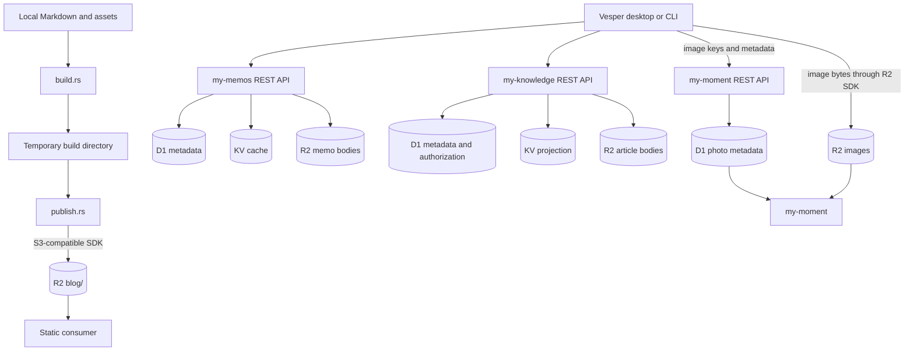

# Local-to-Consumer Workflow

Vesper has two delivery paths. Static publication uploads a complete local build to R2. Consumer
operations update one deployed application through its authenticated API, with direct R2 access only
where binary transfer is intentionally owned by the local client.

## Infrastructure map



## Static publication

`vesper build` delegates to `build.rs`. The builder walks `content/`, renders Markdown through
`markdown.rs`, copies regular assets, rejects symbolic links and output collisions, and writes a
`content.json` index into an operating-system temporary directory.

`vesper publish` builds the same directory and reports the planned object count. It does not mutate
remote state. `vesper publish --live` passes the staged files to `publish.rs`, which uploads them
through `r2.rs` below the `blog/` prefix. The temporary directory is removed when its Rust guard is
dropped. Publication is additive and does not delete destination-only objects.

## Memos

Memo metadata operations use the my-memos REST API. Create, update, and delete requests must pass
through the Worker so R2 bodies, D1 metadata, and KV invalidation remain one server-coordinated
transaction. List and search return metadata plus each `r2Key`; Vesper then reads those Markdown
bodies with `r2.rs` and renders them locally.

CLI surface:

```text
vesper memo tags
vesper memo list [limit]
vesper memo search <query>
vesper memo create <markdown>
vesper memo update <id> <markdown>
vesper memo delete <id>
```

## Knowledge

Knowledge always enters through the authenticated my-knowledge REST API. The Worker performs D1
authorization before resolving KV or R2 data. Updates and deletion include the current
`expectedHash`; a stale local copy fails instead of overwriting a newer article.

Complex create and update payloads are passed as one quoted JSON argument. This keeps multilingual
documents and optional fields aligned with the API contract rather than inventing a second CLI
schema.

```text
vesper knowledge list [cursor]
vesper knowledge get <id>
vesper knowledge create <json>
vesper knowledge update-draft <id> <json>
vesper knowledge update-documents <id> <json>
vesper knowledge visibility <id> <json>
vesper knowledge delete <id> <expected-hash>
```

## Moment

Moment separates binary transfer from metadata coordination. Upload the original and thumbnail to R2
first, then register their exact object keys with the REST API. The consumer resolves the metadata
from D1 and reads the image objects from R2.

```text
vesper moment upload <r2-key> <local-path>
vesper moment create '<json-with-r2Key-and-thumbnailR2Key>'
```

If metadata registration fails, the uploaded objects are orphans. Inspect the error, retry the same
metadata request, or explicitly remove the orphan with `vesper moment remove-object <r2-key>`. Do not
remove an object referenced by an existing photo record. `moment delete <id>` is the normal metadata
deletion path; raw object removal is an explicit maintenance operation.

The remaining Moment commands cover tags, listing, search, metadata updates, downloads, and deletion:

```text
vesper moment tags
vesper moment list [cursor]
vesper moment search <query>
vesper moment update <id> <json>
vesper moment download <r2-key> <local-path>
vesper moment delete <id>
```

## Todo

Todo operations are local and require no credential. Desktop and CLI share the date-keyed
`todos.json` file in Vesper's operating-system application data directory. The previous
`today-todos.json` file is ignored without fallback or migration. CLI commands infer the current
local date, while the desktop month calendar can select any date. At local midnight Rust
advances today's view to the new empty list without deleting previous lists.

```text
vesper todo list
vesper todo get <id>
vesper todo create <text>
vesper todo update <id> <text>
vesper todo complete <id>
vesper todo reopen <id>
vesper todo delete <id>
```

## Credentials and failure boundaries

Release builds read consumer API keys and R2 credentials from the operating-system credential store.
Debug builds can use the variables listed in `.env.example` to avoid repeated macOS Keychain prompts
from ad-hoc-signed development binaries. Provider failure is isolated: an API metadata failure does
not silently become an R2 success, and an R2 upload does not imply that consumer metadata exists.
